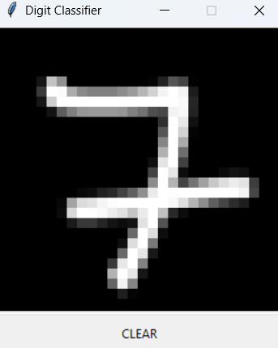
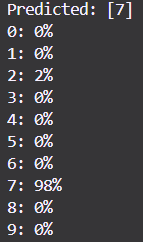

# Handwritten Digit Classifier

This project is a simple application that recognizes handwritten digits (0-9). It uses a basic neural network built with PyTorch and trained on the MNIST dataset. The GUI, created with Tkinter, allows users to draw a digit and see the model's prediction in real-time.

## Features
- Drawing canvas; draw digits using a mouse
- Real-time predicition; process & return predicitions instantly
- Model creation/training; create training model and train it from scratch using the MNIST dataset
  
## Resources used
- Python3
- NumPy
- PyTorch; for building and training model
- Torchvision; loading the MNIST dataset
- Pillow; image manipulation and processing
- Tkinter; GUI

## Setup
### Building/Training model
Run `python trainer.py` to build the model and train it using preset parameters.

### Running the UI for handwritten classification
Run `python main.py`, draw a digit to see predictions in the output.